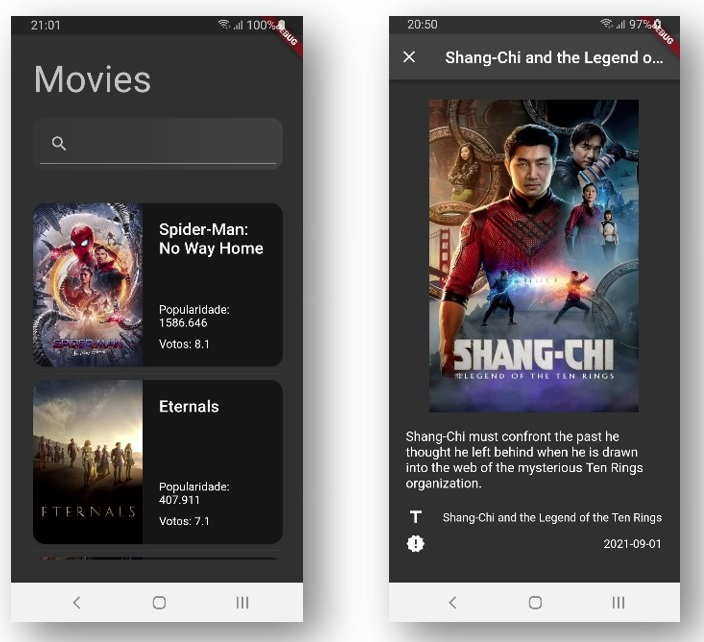

# MovieApp

Projeto desenvolvido durante as aulas do professor [Deivid Willyan](https://www.youtube.com/c/DeividWillyan) para consumo de uma API de filmes com Cache Offline.

[FLUTTER NV1 - Movie APP](https://www.youtube.com/watch?v=I7K6krnsEzc&list=PLRpTFz5_57cvo0CHf-AnojOvpznz8YO7S&index=24)

## Packages usados
- dio
- cached_network_image
- lottie
- shared_preferences

## Layout



## Executando o projeto

Defina no arquivo .env o token da API The Movie Database (remova o .example do arquivo .env.example).
 
 ```cl
TOKEN=
```